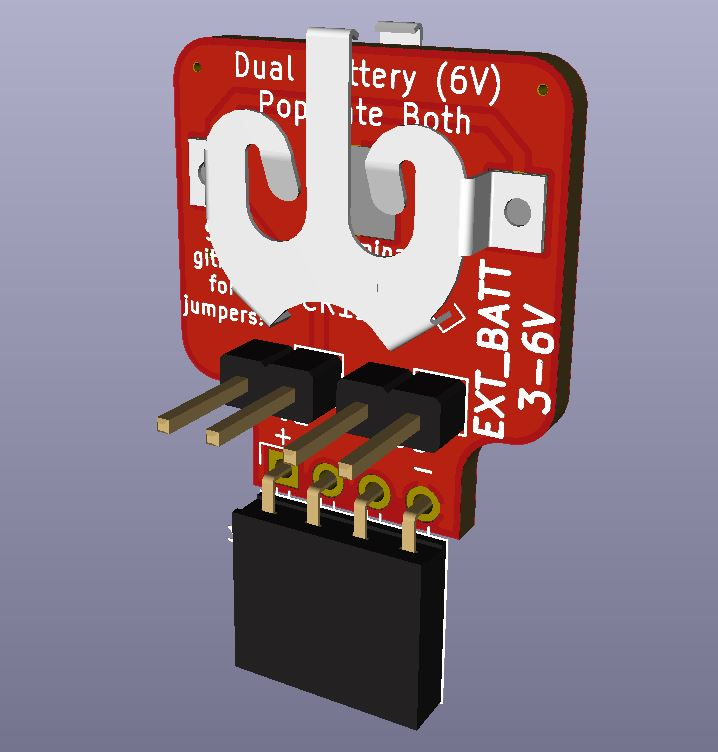
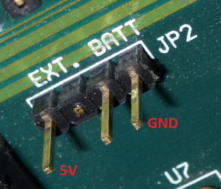

# EXT_BATT 3-6V Version
A battery supply for retro motherboards with an EXT_BATT header.

\

\
^--photo from minuszerodegrees showing EXT_BATT header

## Info
I have quite a few 386 and 486 motherboards that have an EXT_BATT header, but I've removed the rechargable Varta. This PCB project is aimed at using the EXT_BATT header to provide a solution to keep your CMOS settings saved and RTC ticking. The MAX40200 chip provides for "ideal diode" functionality with less than a 43mV drop in voltage. It also prevents a charge circuit from trying to charge the CR1220 type batteries if the motherboard happens to have a charge circuit on the EXT_BATT header. (rare occurences) I prefer this board because the batteries are cheap, last a long time, and the EXT_BATT header is usually in an easier spot to get to than where the Varta battery is crammed on most boards. Regardless, check the batteries every few years.

## BOM
* This circuit board, ordered from your fabricator of choice. (JLCPCB, PCBway, OSH Park, etc.)
* Maxim MAX40200AUK+T Ideal Diode
* 2x Keystone Electronics 2894 battery holders
* 1x04 2.54mm pitch right angle pin socket, or 1x04 2.54mm pitch straight pin socket, or 1x04 2.54mm male pin headers (see below for mounting orientations)
* (2) 1x02 2.54mm pitch straight pin headers
* (1) 1x02 2.54mm pitch jumper
* 2x CR1220 batteries

## Jumper Settings

|   J2  | J3    | Result |
| ---   | ---   | ---    |
| SHORT | OPEN  | 6V |
| OPEN  | SHORT | 3V |
| SHORT | SHORT | Smoke |
| OPEN  | OPEN  | Nothing |

For 3V, populate the rear battery only. For 6V, populate both batteries. The negative battery terminal faces the PCB.
\
\
3V may work for your board, as there are many people that report a single 3V lithium cell is able to power their RTC. Of course, it depends on the minimum input voltage rating for the RTC chip. For 6V, please check your motherboard manual first to see if it will accept a voltage at that level.

## Installation
Set the jumper and plug the completed board into the EXT_BATT header. Several motherboards also use an INTERNAL/EXTERNAL jumper to select between the factory installed battery and the EXT_BATT header.
\
\
Mounting orientations:
* Vertical - this PCB sits about 32mm tall when installed vertically. 
* Horizontal - may be possible depending on your board's EXT_BATT header location/orientation and other nearby components.
* Remote - use pin header extension wires to connect to the EXT_BATT header and put the PCB somewhere else in the case.

## Other
Reference material for retro motherboard batteries: http://minuszerodegrees.net/battery/cmos/vintage_motherboard_batteries.htm
\
This project is open source, feel free to do what you want with it.
